# Sleep Health Analytics

**End-to-end analytics project: raw CSV → PostgreSQL (cleaned, normalized) → 13 SQL queries → 13 Tableau charts.**

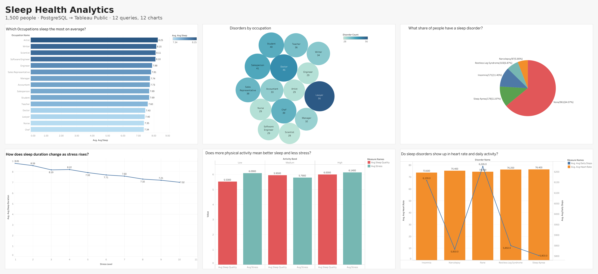

A 1,500-person sleep and lifestyle dataset, loaded into PostgreSQL, cleaned, split into a six-table relational schema, and analysed with SQL. Each query's result was exported and visualised in Tableau Public, with the chart type chosen to fit the question rather than the other way round.

| | |
|---|---|
| **Data** | 1,500 people × 13 attributes (sleep, lifestyle, health, occupation) |
| **Database** | PostgreSQL — staging table, 2 dimension tables, 1 hub, 3 fact tables |
| **Analysis** | 13 queries in `sql/04_analysis_queries.sql` |
| **Visualisation** | Tableau Public — bar, colour-encoded bar, packed bubbles, pie, side-by-side bar, line, dual-axis |
| **Author** | Ajinkya (AJ) Kaduskar · [github.com/ajinkyakaduskar](https://github.com/ajinkyakaduskar) |

---

## Key findings

**Stress is the strongest predictor of sleep in this dataset.** Average sleep duration falls almost monotonically from 8.81 hours at stress level 1 to 7.02 hours at stress level 10 — nearly two hours. Every other relationship examined is weaker.

**More than a third of people report a sleep disorder.** 64% have none; Sleep Apnea (11.9%) and Insomnia (11.4%) are nearly tied as the most common, followed by Restless Leg Syndrome (6.9%) and Narcolepsy (5.8%).

**Lawyers report the most disorders by a wide margin** — 56 people, versus 46 for the next occupation (Doctor) and 28–29 for the five lowest. The bottom third of occupations is effectively tied.

**Physical activity helps sleep quality but not stress.** Sleep quality rises with activity band (5.53 → 5.95 → 6.00), but stress does not fall — it is highest in the High-activity group (6.14). The hypothesis that exercise reduces stress is not supported here.

**Sleep disorders show up in activity, not heart rate.** Resting heart rate barely varies across disorder groups (73.6–76.4 bpm, within noise). Daily steps do: people with no disorder walk ~6,200 steps; three of the four disorder groups walk 300–400 fewer.

**BMI has almost no effect on sleep quality.** The full range across four BMI categories is 5.77–5.95 — a 0.18 spread on a 10-point scale.

---

## Pipeline

```
data/raw_sleep_health.csv
        │
        ▼  01_load_raw.sql          all-TEXT staging table
   raw_sleep
        │
        ▼  02_clean.sql             drop header row · split "111/71.15" blood pressure
   raw_sleep (typed)                · cast TEXT → INT / NUMERIC
        │
        ▼  03_normalize.sql
   occupation ─┐
   sleepdisorder ├─► person ─► sleepdata · lifestyledata · healthmetrics
        │
        ▼  04_analysis_queries.sql  12 queries → data/query_results/*.csv
        │
        ▼
   Tableau Public                    tableau/sleep_health_dashboard.twbx
```

### Schema

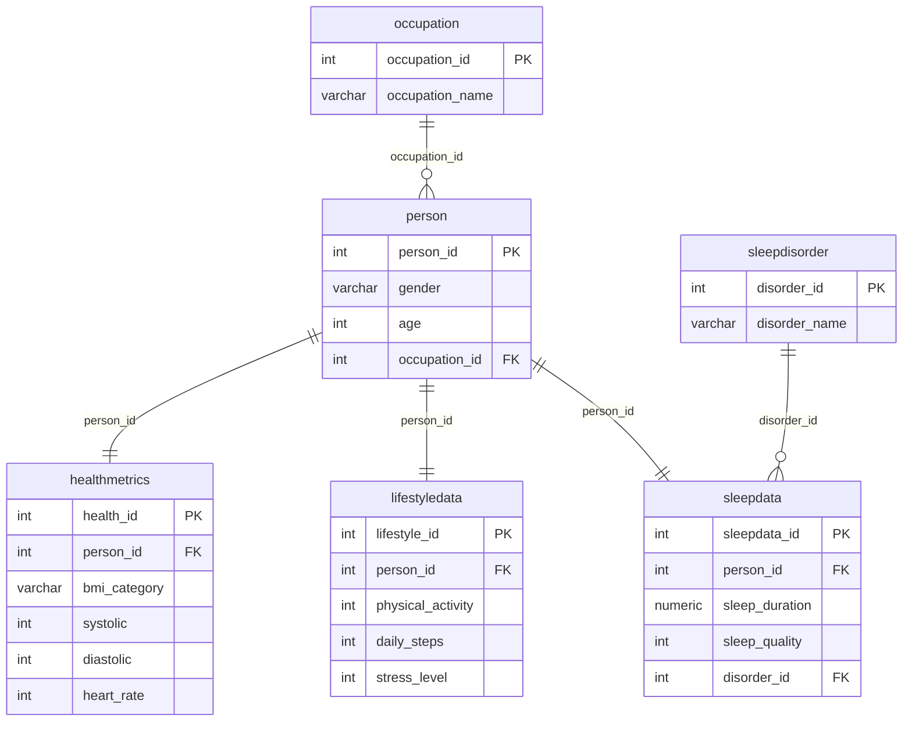

The raw file had a combined `Blood Pressure` column ("129/85.85"). It was split into `systolic` and `diastolic` integers during cleaning, and the header row that pgAdmin's import wizard loads as data was deleted before type conversion.

---

## The 13 charts

Each chart is titled as the question it answers. Chart type was chosen by the shape of the data: bars for comparing a measure across categories, a line for an ordered axis, a pie only where the slices are counts that sum to a whole, and two-measure forms where two queries shared a `GROUP BY`.

### Q1 · Which occupations sleep the most on average?
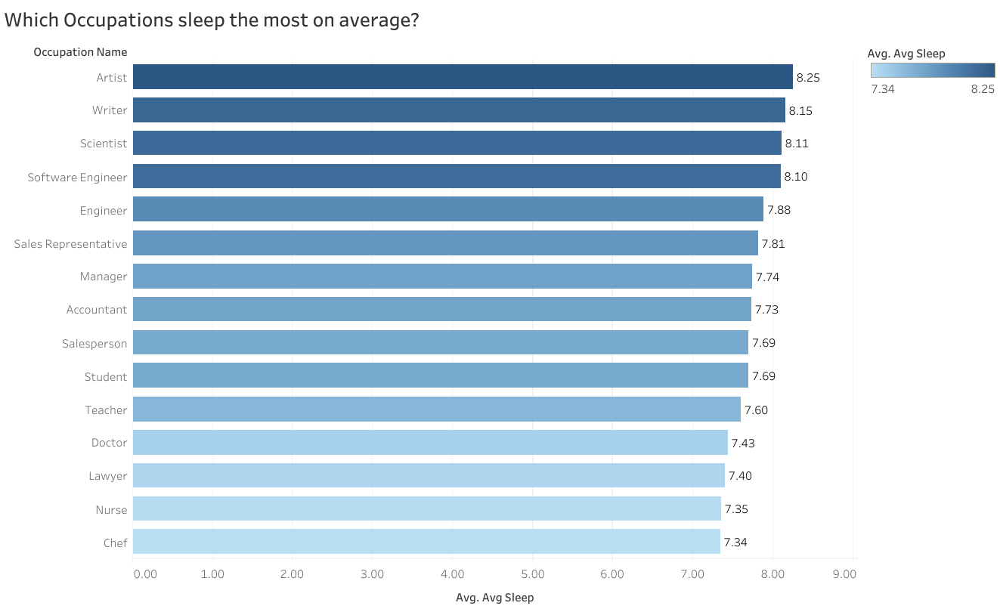
Colour-encoded horizontal bar, sorted descending. Artists (8.25 h) and Writers (8.15 h) sleep the most; Chefs (7.34 h) and Nurses (7.35 h) the least. The whole spread is under an hour.

### Q2 · Does more physical activity improve sleep quality?
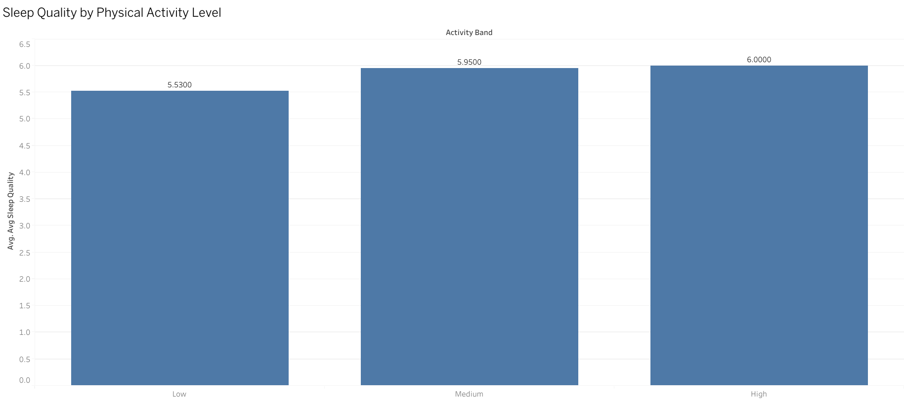
Bar, bands in ordinal order. Yes, modestly: 5.53 → 5.95 → 6.00. Most of the gain is from Low to Medium.

### Q3 · Do stressed people sleep less?
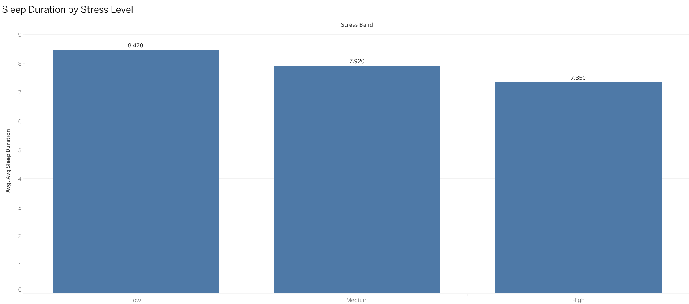
Bar, ordinal. Yes — 8.47 h (Low) → 7.92 h (Medium) → 7.35 h (High). Q12 shows the same relationship at full 1–10 resolution.

### Q4 · Does BMI affect sleep quality?
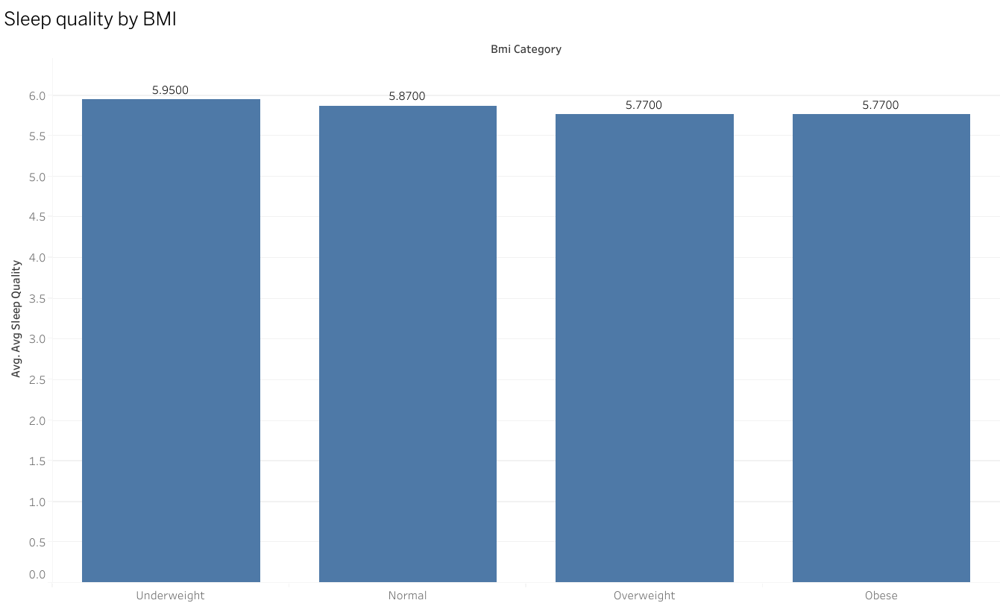
Bar, ordered Underweight → Obese. Barely: 5.95 / 5.87 / 5.77 / 5.77. Overweight and Obese are identical.

### Q5 · Average resting heart rate by sleep disorder
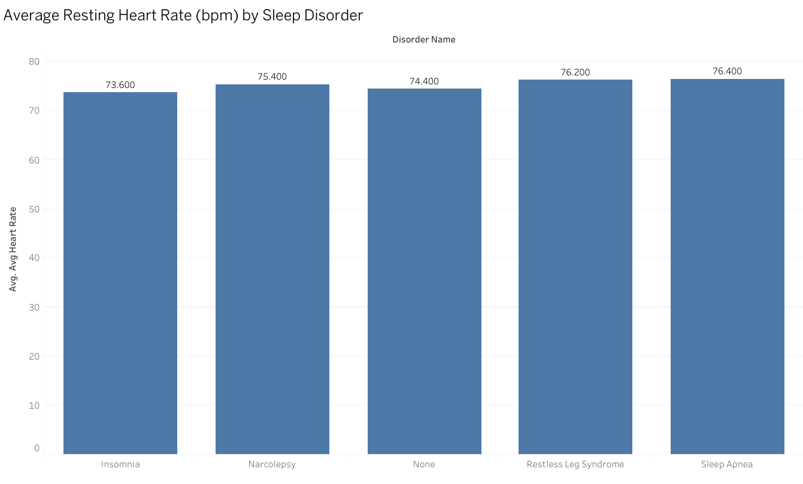
Bar. Range 73.6–76.4 bpm across all five groups — no meaningful separation. Feeds Q13.

### Q6 · Average daily steps by sleep disorder
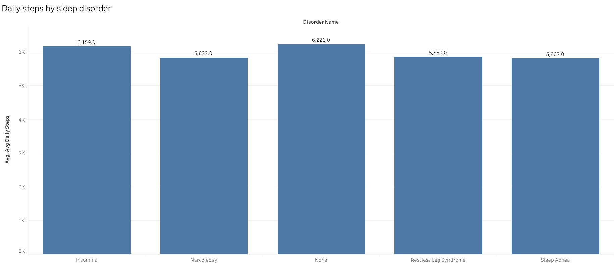
Bar. None 6,226 · Insomnia 6,159 · RLS 5,850 · Narcolepsy 5,833 · Sleep Apnea 5,803. Feeds Q13.

### Q7 · Does physical activity reduce stress?
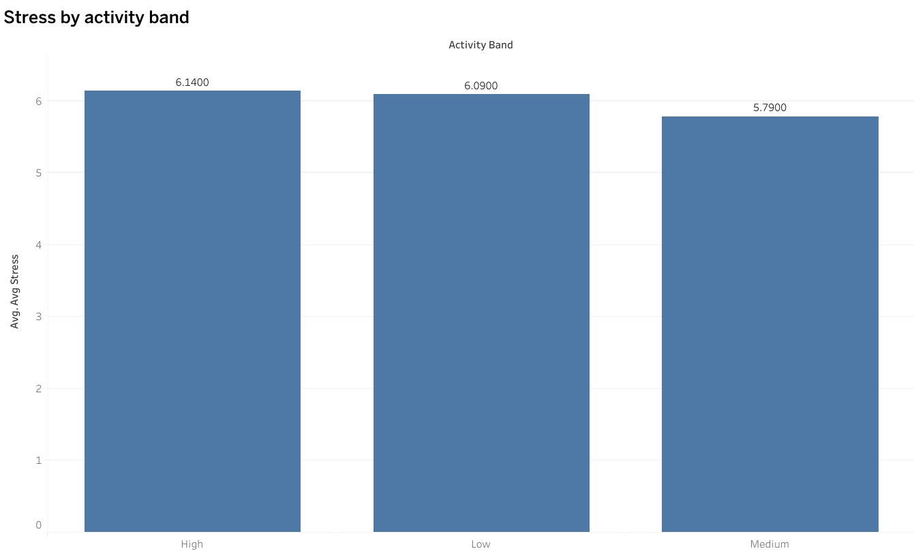
Bar. No — stress is 6.09 (Low), 5.79 (Medium), 6.14 (High). Feeds Q10.

### Q8 · Which occupations report the most sleep disorders?
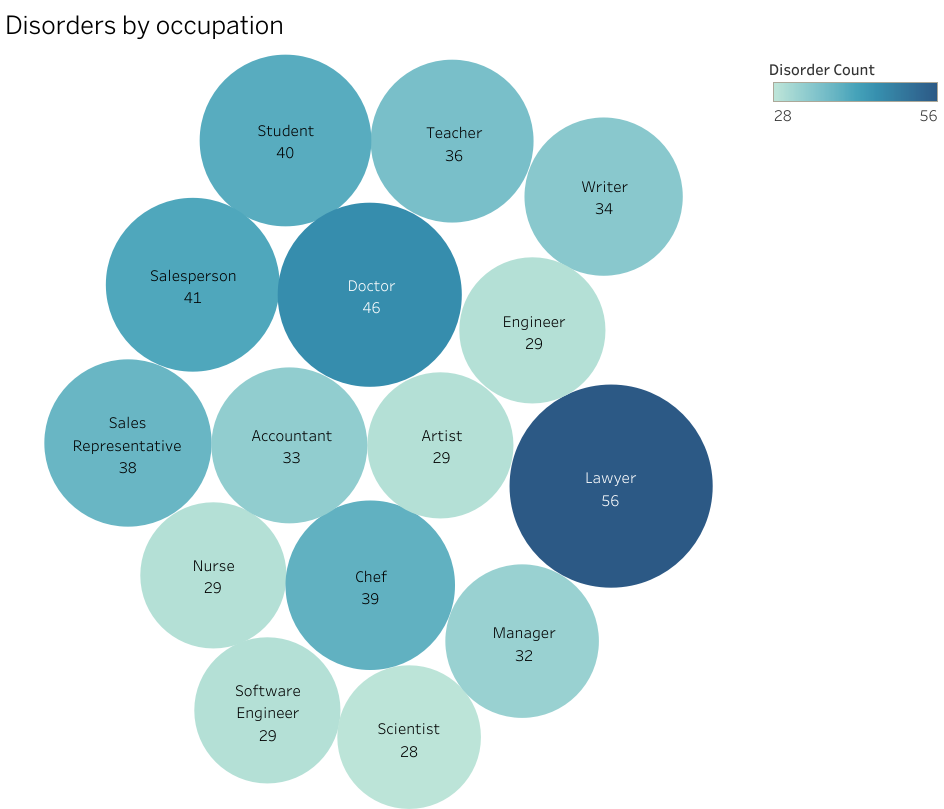
Packed bubbles, sized and coloured by count, `None` excluded. Lawyer 56 is the clear outlier; five occupations tie at 28–29. Bubbles suit "who's the outlier"; the sorted bar (Q1 style) would be better for reading exact ranks.

### Q9 · What share of people have a sleep disorder?
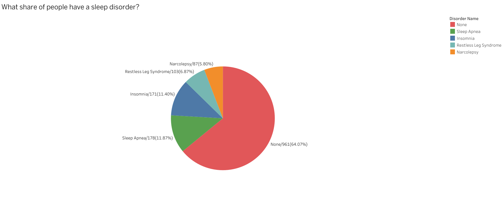
Pie, five slices, sorted clockwise from largest. The only pie in the set — it is the only query returning counts that sum to a whole (1,500). Averages (Q2–Q7) are never shown as pies.

### Q10 · Does more physical activity mean better sleep and less stress?
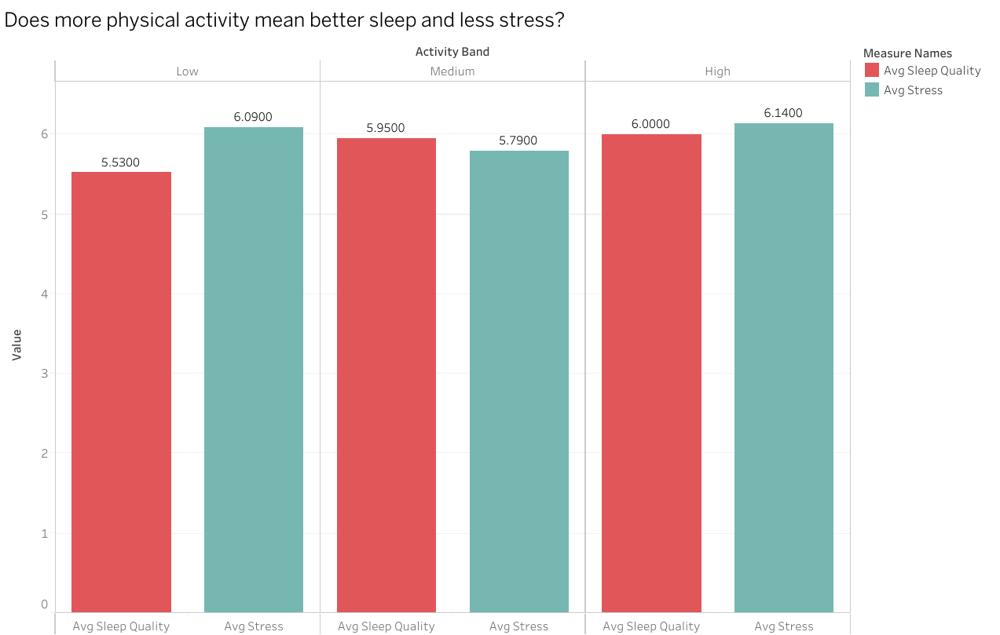
Side-by-side bar (`Measure Names` on colour). Q2 and Q7 merged into one query with two aggregates. Both measures are on a 1–10 scale, so they can share an axis. Sleep quality rises with activity; stress does not fall.

### Q12 · How does sleep duration change as stress rises?
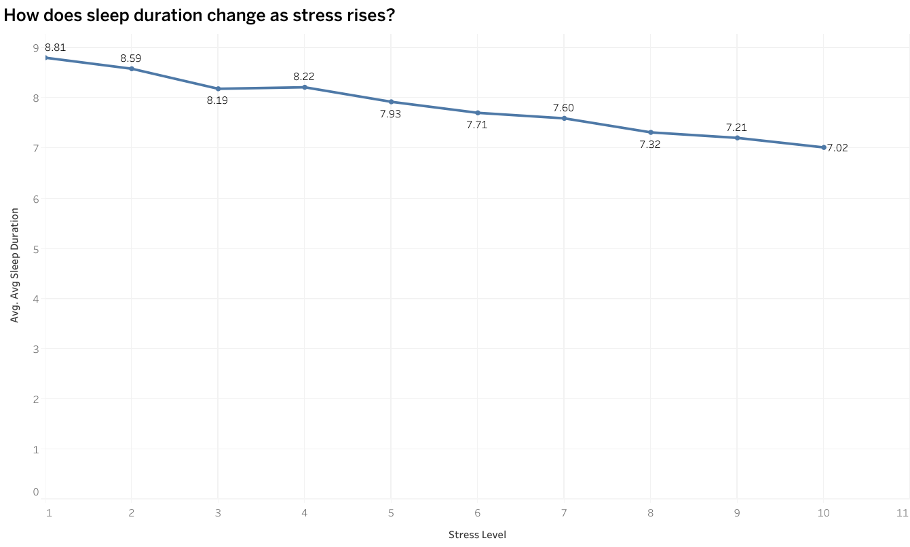
Line, stress 1–10 on a continuous axis. Q3 without the banding. Steady decline from 8.81 h to 7.02 h with one small bump at level 4. The strongest relationship in the dataset.

### Q13 · Do sleep disorders show up in heart rate and daily activity?
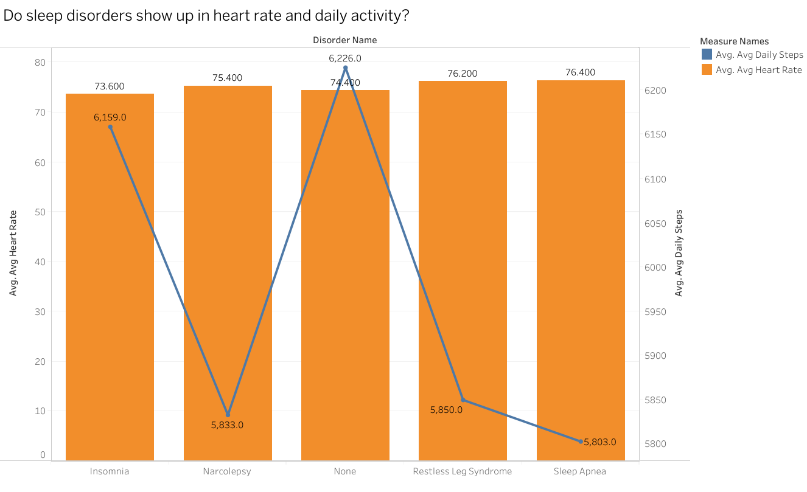
Dual-axis: heart rate as bars (left axis, bpm), daily steps as a line (right axis). Q5 and Q6 merged. The scales differ by two orders of magnitude, so the axes are independent — synchronising them would flatten the line to nothing. Heart rate is flat; steps separate the groups.

---

## What the data can't tell you

- **Correlation, not causation.** Lawyers reporting more disorders does not mean law causes them; occupation is confounded with age, income, shift work and everything else not in the file.
- **Self-reported scales.** Sleep quality and stress are 1–10 self-ratings. A 0.5-point difference between groups is within the noise of how people interpret the scale.
- **Uneven group sizes.** Narcolepsy has 87 people; None has 961. Averages over small groups are less stable.
- **Synthetic-looking data.** Blood pressure values like `85.85000000000001` suggest the file was generated or augmented, not collected. Treat the findings as an exercise in method, not as health evidence.
- **Nurses and Doctors sleep the least but report mid-range disorder counts.** Shift work is the obvious explanation, but the dataset has no shift variable to test it.

---

## Repository layout

```
sleep-health-analytics/
├── README.md
├── sql/
│   ├── 00_original_working_script.sql   the raw scratch file, kept for honesty
│   ├── 01_load_raw.sql                  CREATE raw_sleep + import notes
│   ├── 02_clean.sql                     header delete, BP split, type casts
│   ├── 03_normalize.sql                 6-table schema + INSERT … SELECT
│   └── 04_analysis_queries.sql          the 12 queries, commented
├── data/
│   ├── raw_sleep_health.csv             1,500 rows, original
│   └── query_results/                   12 CSVs, one per query (Tableau inputs)
├── tableau/
│   └── sleep_health_dashboard.twbx      all 12 sheets + 2 dashboards, data packaged
└── images/
    ├── dashboard.png                    six headline charts
    └── q01 … q13 .png                   one image per chart
```

## Reproducing it

1. Create a PostgreSQL database and run `sql/01_load_raw.sql`.
2. Import `data/raw_sleep_health.csv` into `raw_sleep` (pgAdmin Import wizard with header on, or `\copy` — both noted in the script).
3. Run `02_clean.sql`, then `03_normalize.sql`. The row-count check at the end of `03` should show 1,500 for every table except the two dimensions (15 and 5).
4. Run any query in `04_analysis_queries.sql`; results should match `data/query_results/`.
5. Open `tableau/sleep_health_dashboard.twbx` in Tableau Public. The CSVs are packaged inside, so no path fixing is needed. Tableau Public will ask you to create extracts before it lets you re-save.

## Tools

PostgreSQL 16 · pgAdmin 4 · Tableau Public 2026.2
